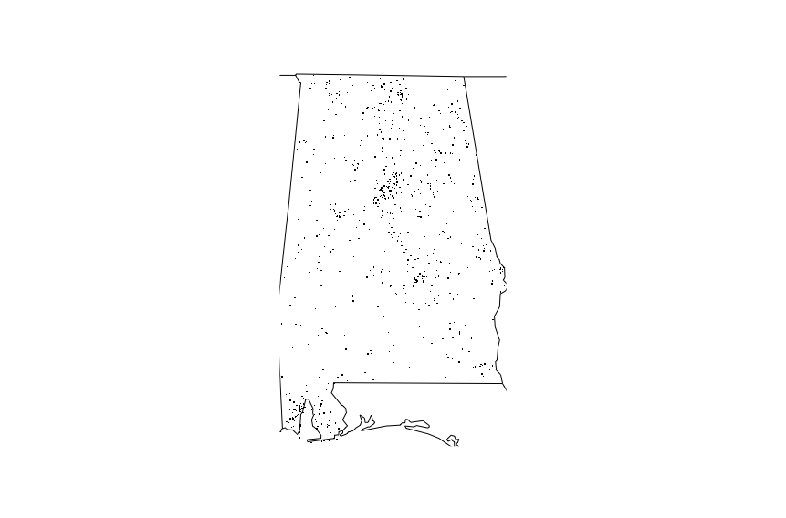

## Package Info

rdrfars package provides functionality to read and process [FARS (Fatality Analysis Reporting System)](https://www-fars.nhtsa.dot.gov/Main/index.aspx) data along with some data samples.

## Functions

The package provides following functions:

* fars_read
* fars_summarize_years
* fars_map_state


### fars_read

Function reads FARS data in csv and returns dlpyr::tbl_df as result

```{r, fig.show='hold', eval = FALSE}
library(rdrfars)
d <- fars_read("accident_2014.csv.bz2")
```

    # A tibble: 30,202 x 50
       STATE ST_CASE VE_TOTAL VE_FORMS PVH_INVL  PEDS PERNOTMVIT PERMVIT PERSONS COUNTY  CITY   DAY MONTH  YEAR DAY_WEEK  HOUR MINUTE   NHS
       <int>   <int>    <int>    <int>    <int> <int>      <int>   <int>   <int>  <int> <int> <int> <int> <int>    <int> <int>  <int> <int>
    1      1   10001        1        1        0     0          0       8       8    115     0     6     1  2013        1     0     55     1
    2      1   10002        2        2        0     0          0       2       2     55  1670     3     1  2013        5    21     24     1
    3      1   10003        1        1        0     0          0       1       1     89  1730     6     1  2013        1    11     45     0
    4      1   10004        1        1        0     0          0       3       3     73   350     6     1  2013        1    12     25     0
    5      1   10005        2        2        0     0          0       3       3    125  3050     6     1  2013        1    18     28     1
    6      1   10006        2        2        0     0          0       3       3     97  2100     8     1  2013        3    14     31     1
    7      1   10007        1        1        0     0          0       1       1     95    50    11     1  2013        6    21     30     0
    8      1   10008        2        2        0     0          0       2       2     49  2904    14     1  2013        2    14     49     0
    9      1   10009        1        1        0     0          0       1       1     17     0     5     1  2013        7    16     21     0
    10     1   10010        2        2        0     0          0       4       4     51     0     5     1  2013        7    17     34     0
    # ... with 30,192 more rows, and 32 more variables: ROAD_FNC <int>, ROUTE <int>, TWAY_ID <chr>, TWAY_ID2 <chr>, MILEPT <int>,
    #   LATITUDE <dbl>, LONGITUD <dbl>, SP_JUR <int>, HARM_EV <int>, MAN_COLL <int>, RELJCT1 <int>, RELJCT2 <int>, TYP_INT <int>,
    #   WRK_ZONE <int>, REL_ROAD <int>, LGT_COND <int>, WEATHER1 <int>, WEATHER2 <int>, WEATHER <int>, SCH_BUS <int>, RAIL <chr>,
    #   NOT_HOUR <int>, NOT_MIN <int>, ARR_HOUR <int>, ARR_MIN <int>, HOSP_HR <int>, HOSP_MN <int>, CF1 <int>, CF2 <int>, CF3 <int>,
    #   FATALS <int>, DRUNK_DR <int>


### fars_summarize_years
Function summarize accidens for year (years) by months

```{r, fig.show='hold', eval = FALSE}
library(rdrfars)
s <- fafars_summarize_years(c(2013))
s
```
Will result following:


    # A tibble: 12 x 2
       MONTH `2013`
    *  <int>  <int>
    1      1   2230
    2      2   1952
    3      3   2356
    4      4   2300
    5      5   2532
    6      6   2692
    7      7   2660
    8      8   2899
    9      9   2741
    10    10   2768
    11    11   2615
    12    12   2457 

### fars_map_state
Function summarize accidens for year (years) by months

This function generates a US state map with the locations of the
fatalities for a given year. An error is given if the state number is not
present in the data set. If no fatalities present a messages is generated

```{r, fig.show='hold', eval = FALSE}
library(rdrfars)
fars_map_state("01", 2013)
```

Will produce following map:
```{r echo=FALSE, out.width='100%'}

```


Notes^[This is a toy packag. It is created as assigment in "Mastering Software development in R" specialization on coursera]
